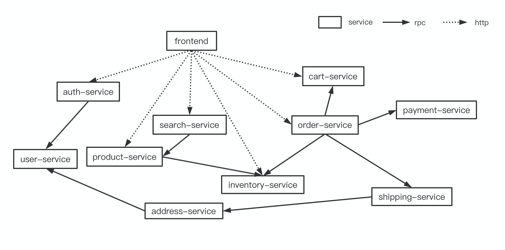
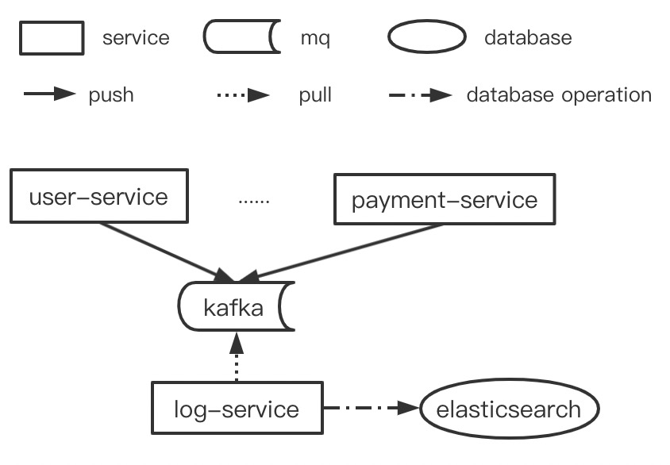

## 系统简介
出于测试和演示的需要，我们开发了Shopping Plus。

Shopping Plus使用Spring Cloud微服务开发框架搭建，实现了网上购物交易的业务逻辑。在通信方式上Shopping Plus拥有RPC、Http和MQ等多种通信方式，调用链类型有星型和链型等。在数据库和中间件方面，Shopping Plus使用了包含MySQL、Redis和Elasticsearch在内的多类型的数据库，并且支持动态切换数据库版本。Shopping Plus还使用了Kafka作为消息队列以解决特殊场景下的异步通信需求，如日志推送、流量削峰和操作解耦等，此外，Shopping Plus也使用了XXL-JOB作为分布式任务调度平台用来解决定时结算和支付超时等需求。

## 基本架构

## 数据库和中间件
Service Name | Database | MQ and Operation
--- | --- | ---
user-service | mysql | kafka(write)
auth-service | mysql | kafka(write)
product-service | mysql | kafka(write)
inventory-service | mysql | kafka(write)
order-service | mysql | kafka(write)
payment-service | mysql | kafka(write)
shipping-service | mysql | kafka(write)
address-service | mysql | kafka(write)
search-service | elasticsearch | kafka(write)
log-service| elasticsearch | kafka(read)
cart-service | redis | kafka(write)

## 消息队列相关架构

## 分布式定时调度任务
